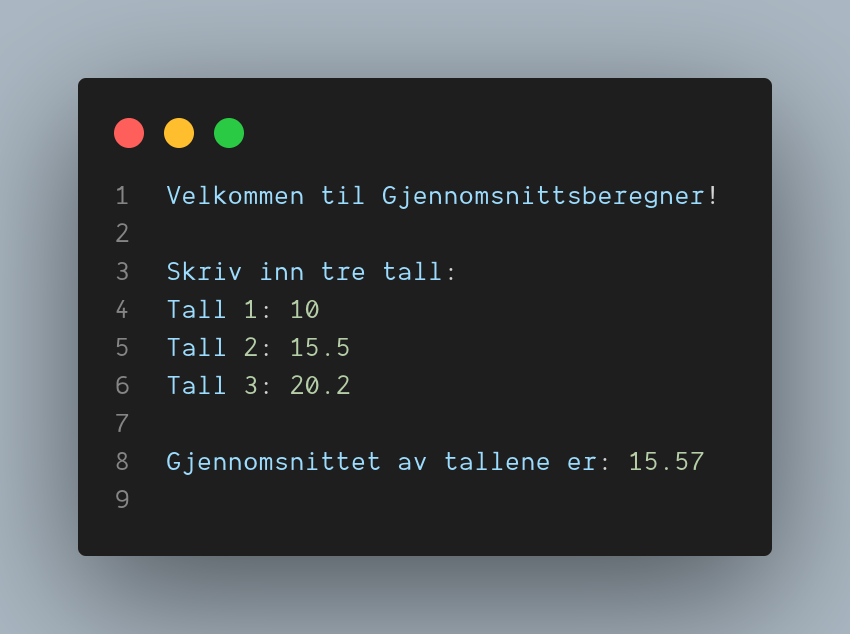

# Oppgave: Beregn Gjennomsnittet 

## Beskrivelse: 

Skriv et C#-program som tar imot tre tall fra brukeren og beregner gjennomsnittet av disse tallene. Programmet skal vise resultatet på skjermen.  

## Instruksjoner: 
1. Be brukeren om å oppgi tre tall. 
2. Les inn tallene fra brukeren og lagre dem i separate variabler. 
3. Bruk en passende formel eller metode for å beregne gjennomsnittet av tallene. 
4. Skriv ut gjennomsnittet på skjermen. 

## Krav: 

* Programmet skal validere at brukerens inndata er gyldige tall. Hvis brukeren skriver inn ugyldige tall, skal programmet gi en feilmelding og be om nye tall. 
* Programmet skal håndtere desimaltall som inndata og beregne gjennomsnittet med desimalpresisjon. 
* Programmet skal være godt strukturert med bruk av passende variabler, kommentarer og klart definerte trinn for inndata, beregning og utdata. 

Eksempel på programkjøring: 



Her er et utgangspunkt for å løse oppgaven. Du kan bygge videre på dette eller implementere det på din egen måte: 

```csharp

using System;

class Program
{
    static void Main()
    {
        Console.WriteLine("Velkommen til Gjennomsnittsberegner!\n");

        double tall1, tall2, tall3;
        bool validInput;

        do
        {
            Console.Write("Skriv inn tre tall:\nTall 1: ");
            validInput = double.TryParse(Console.ReadLine(), out tall1);

            Console.Write("Tall 2: ");
            validInput &= double.TryParse(Console.ReadLine(), out tall2);

            Console.Write("Tall 3: ");
            validInput &= double.TryParse(Console.ReadLine(), out tall3);

            if (!validInput)
            {
                Console.WriteLine("Ugyldig inndata. Vennligst skriv inn tall på riktig format.");
            }
        } while (!validInput);

        double gjennomsnitt = (tall1 + tall2 + tall3) / 3;
        Console.WriteLine($"\nGjennomsnittet av tallene er: {gjennomsnitt.ToString("F2")}");
    }
}
```

